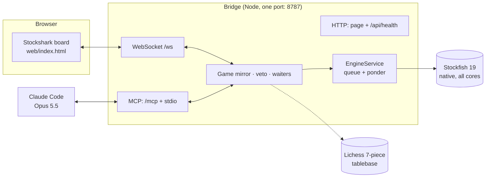
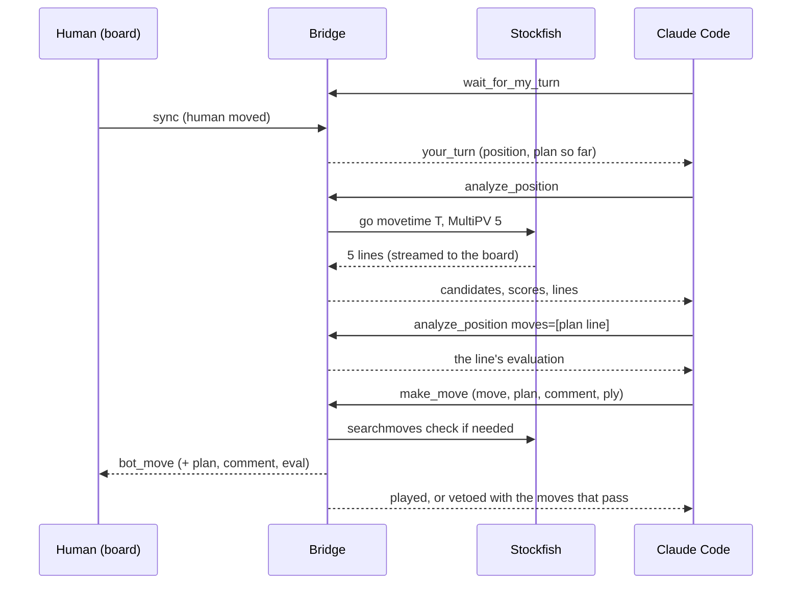

# Stockshark: the plan

Claude as the strategist, Stockfish as the calculator, on the Stockshark Bot board. Together they are the board's one bot, **Stockshark 1**; Stockfish 19 can also play alone.

This document is the design: what we're building, how the pieces talk, how a move gets chosen, how strong it is, and what comes next. Phases 1 and 2 are built and tested in this folder; later phases are proposals.

## 1. Goal

Turn the Stockshark Bot page (a full-rules board with a greedy one-move bot) into an opponent that:

1. plays at the strongest level available on the machine, with no regard for speed;
2. thinks in plans the human can read, not just moves;
3. works with Claude through MCP (Claude Code with Opus 5.5), and still works as a claude.ai artifact.

The honest constraint behind the design: no language model makes Stockfish stronger at choosing moves. Claude's value is the plan, the explanation and the character of the play. So the design lets Claude choose, and makes Stockfish guarantee that the choice never costs anything that matters.

## 2. The idea: candidates, a plan, and a veto

Each turn:

1. **Stockfish scouts.** A full-strength MultiPV search returns the top five moves with scores, win/draw/loss odds and main lines.
2. **Claude plans.** It reads the candidates against its plan from the last move, may test one or two concrete continuations with Stockfish, then picks the move that best serves the plan and rewrites the plan (goal, route, what to watch).
3. **Stockfish vetoes.** The pick is scored against Stockfish's best. Inside the margin it is played; outside, it is rejected (MCP: Claude picks again from the moves that pass; artifact: Stockfish's best is played and the board says why).

Engines often rate several moves within a few hundredths of a pawn. Choosing among those by a coherent plan costs nothing measurable and gives the game a shape a person can follow.

### The veto, precisely

Scores are mapped to one ordered number so mates, centipawns and defences compare correctly:

| Score | Value |
| --- | --- |
| mate in *n* (winning) | 1,000,000 − 1000·*n* |
| centipawns *c* | *c* |
| mated in *n* (losing) | −1,000,000 + 1000·*n* |

`loss = value(best) − value(pick)`; the pick passes when `loss ≤ margin`. Because mate distances are 1000 apart, a slower mate never sneaks under a centipawn margin, so the team never dawdles in a won position. With seven pieces or fewer, the Lichess tablebase overrides scores: the pick must keep the exact result, and in a won ending it must be the quickest win (slower wins can drift into the fifty-move rule or a repetition).

| Setting | Margin | Meaning |
| --- | --- | --- |
| Best move only | 0 | Stockfish's own play; Claude plans and narrates |
| Within 0.20 | 20 cp | default; effectively full strength |
| Within 0.50 | 50 cp | more of Claude's style, still far beyond human strength |
| Off | none | Claude decides; Stockfish advises |

A pick that isn't among the scouted candidates is scored with a `searchmoves` search restricted to that move, for the same think time as the scout (capped at 30 s).

## 3. Architecture

**The board owns the game.** The page keeps its own rules engine, history, take-backs and saving. On every change it sends the bridge a `sync` (game id, moves in UCI, who sits on each side, think time, veto). The bridge replays the moves with chess.js and keeps a validated mirror; anything that doesn't replay is ignored.

**The bridge owns the engine.** One Stockfish process, one search at a time. Searches from the board, from Claude's tools and from the veto queue up; a *ponder* search (the engine thinking on the human's time) gives way to anything else at once, but its work stays in the hash table.

**Claude talks only through MCP tools.** It never sees the WebSocket. Its moves reach the board as `bot_move` messages, which the board checks against its own rules before playing.

**Seats.** Each side is You, Stockshark 1 or Stockfish 19. Claude plays every side set to Stockshark 1 (both, if the human seats it twice, with a separate plan per side); Stockfish 19 seats are searched by the board through the same engine; take-backs, draw offers and resignations belong to the people at the board, so a bot-against-bot game has none.

### Two surfaces, one page

| | Local (bridge) | claude.ai artifact |
| --- | --- | --- |
| Stockfish | native universal build, every core, ¼ of RAM as hash | WebAssembly in a worker, 1 thread, up to 1 GB hash |
| Claude | Claude Code via MCP (the human picks the model) | the artifact `sample` capability, `complex` tier |
| Who drives a turn | Claude (it waits, analyses, moves) | the page (it scouts, asks Claude, checks) |
| Claude's Stockfish tool | `analyze_position` (MCP) | `analyze_line` (page function lent to Claude) |
| Tablebase | Lichess API (opt-out) | none (the artifact can't reach other hosts) |

The page decides at load: if `api/health` answers as Stockshark, it connects to the bridge; otherwise it looks for `engine/manifest.json` (the artifact build) and uses WebAssembly; Claude in the artifact lights up when `claude.use("sample")` resolves with tool support.

## 4. Components

| Path | Role |
| --- | --- |
| `web/index.html` | The board. Original rules engine and UI, plus: White and Black player pickers, async bot turns with cancellation, an engine abstraction over the bridge and WebAssembly, the Stockshark's plan panel (with Hide), an evaluation bar, think time, veto and ponder settings. |
| `web/engine/sf-loader.js` | Worker shim: receives the engine bytes from the page and serves them to stockfish.js in place of a network fetch, so the artifact never needs `blob:` fetches. |
| `server/index.mjs` | Entry point. HTTP mode (`npm start`) or stdio mode (`--stdio`); a stdio launch that finds a running bridge forwards MCP to it instead of starting a second board. |
| `server/http.mjs` | One port for the page, the WebSocket and Streamable HTTP MCP. Host and Origin checks against DNS rebinding and cross-site use. |
| `server/bridge.mjs` | Game mirror, page protocol, Claude's turn logic (waiters, analysis, veto, draw offers). |
| `server/engine.mjs` | Engine discovery, full-strength configuration, crash restart, the search queue and pondering. |
| `server/mcp.mjs`, `server/prompt.mjs` | MCP tools, server instructions and the `play` prompt. Tool results are written for a model to read. |
| `server/uci.mjs`, `guard.mjs`, `game.mjs`, `tablebase.mjs` | Pure helpers: UCI parsing and score order, the veto, chess.js helpers, tablebase probing. |
| `scripts/get-stockfish.mjs` | Downloads the official universal build for the platform, test-runs it, records it in `bin/stockfish.json`. |
| `scripts/build-artifact.mjs` | Builds `dist/artifact/` with the engine split into 14 MB parts and a manifest. |

## 5. Protocols

### Board ↔ bridge (WebSocket, JSON)

| From the board | Meaning |
| --- | --- |
| `hello` | This tab is the board (a newer tab takes over; the old one is told `superseded`). |
| `sync {game}` | The whole game: id, start FEN, UCI moves, players per side, think time, veto, outcome, each side's plan. |
| `search {id, fen, moves, movetime, multipv, searchmoves}` / `stop {id}` | Stockfish for the board's own use. |
| `ponder {fen, moves}` / `ponder_stop` | Think on the human's time. |
| `draw_offer {gameId}` | The human offers Claude a draw. |

| From the bridge | Meaning |
| --- | --- |
| `welcome`, `claude` | Engine status; Claude connected / waiting / analysing, plan, comment. |
| `search_info`, `search_done`, `search_error`, `ponder_info` | Engine output for the board. |
| `claude_analysis`, `claude_veto`, `plan` | What Stockfish is computing for Claude; a vetoed pick; a new plan. |
| `bot_move {gameId, ply, color, uci, plan, comment, eval}` | Stockshark's move. The board plays it only if the game id and ply still match. |
| `draw_answer {accept, message}` | Claude's answer to a draw offer. |

### MCP tools

| Tool | What it does |
| --- | --- |
| `get_game` | Board open? Mode, colours, move list, FEN, ASCII board, legal moves, saved plan, settings, engine. |
| `wait_for_my_turn {timeout_seconds}` | Blocks until `your_turn`, `draw_offered` or `game_over`; returns `timeout` otherwise. Sends progress notifications every 20 s when the client asks for progress, and otherwise stays under Claude Code's idle limits (4.5 min over HTTP, 25 min over stdio). |
| `analyze_position {moves, fen, seconds, multipv, depth}` | Full-strength analysis of the live game, of a line from it, or of any FEN; scores from Claude's side; tablebase verdict in small endings. |
| `make_move {move, plan, comment, ply}` | Veto check, then the move goes to the board. `ply` makes a stale move fail after a take-back. |
| `set_plan {plan, comment}` | Update the plan panel without moving. |
| `respond_to_draw_offer {accept, message}` | Answer the human's offer. |
| prompt `play {style}` | The routine Claude follows for a whole game. |

### A turn, end to end (local)

## 6. Strength: what "max" means here

| Lever | Local | Artifact |
| --- | --- | --- |
| Engine | Stockfish 19 official universal build (picks AVX-512/VNNI/AVX2 code at run time) | Stockfish 19 full NNUE, WebAssembly |
| Threads | every logical core | 1 (no cross-origin isolation in the artifact host) |
| Hash | ¼ of RAM, power of two, up to 32 GB | 1 GB on desktops with 8 GB+, less on phones |
| Skill | Skill Level 20, `UCI_LimitStrength` off | same |
| Think time | 5 s to 10 min a move (default 1 min) | same |
| Thinking on the human's time | open-ended ponder search, preempted instantly, capped at 15 min | same |
| Endgames | Lichess 7-piece tablebase; local Syzygy via `SYZYGY_PATH` | engine only |
| Move choice | MultiPV 5 for candidates, veto against the best | same |

Rough numbers measured while building this, on a 4-core cloud container: the WebAssembly engine in Node ran about 0.9 M nodes/s on four threads, and the single-threaded full network in Chromium about 0.2 M nodes/s. A native build on a modern desktop runs tens of millions of nodes per second. Every doubling of time or speed is worth roughly 40 to 60 Elo at this level; all of these configurations are far beyond any human.

One deliberate trade: MultiPV 5 spends search effort on five lines instead of one. For pure strength the strict veto plus a final single-line search would be marginally better; the current design accepts the small cost because the candidates are what Claude plans with.

## 7. Security and privacy

- The bridge listens on `127.0.0.1` only. Every HTTP and WebSocket request must carry a loopback `Host`, and a browser `Origin`, if present, must be the board's own. Other websites can't drive the board, the engine or the MCP endpoint.
- Everything the page sends is validated (FENs by chess.js, moves replayed, UCI tokens matched by pattern) before it reaches Stockfish's command line, so nothing can inject UCI commands.
- The only outside traffic is the optional tablebase lookup: positions with seven pieces or fewer go to `tablebase.lichess.ovh` (`STOCKSHARK_TABLEBASE=0` turns it off).
- In the artifact, Claude runs on the viewer's own account and asks permission on first use.

## 8. Testing

Done while building:

- `npm test`: unit tests (UCI parsing, score order, veto with mates and tablebases, SAN/UCI reading, downloader helpers) and an integration test that starts a bridge, plays Claude's side through a real MCP client against a simulated board (wait, analyse, veto, move, take-back, draw offer, the board's own searches) and checks that a second stdio launch forwards to the running bridge, plus Stockshark on both sides and against Stockfish 19. 21 tests, all passing.
- Chromium, against the bridge: Stockfish replies and ponders; a real MCP client plays a turn while the board shows the analysis, the plan and the comment; draw offer round trip; no console errors; no horizontal scroll at phone width in dark mode.
- Chromium, as the artifact build: lite and full engines load from parts (full: about 8 s the first time, about 3 s from IndexedDB); Claude's turn with a stand-in for `sample` (prompt, tool call, plan, veto replacing a bad pick).
- `get-stockfish` against a stand-in release archive (the sandbox couldn't reach GitHub): download, unpack, test-run, registration, and the bridge picking it up first.

Not verifiable from the build sandbox, to check on first real use: the official GitHub download, Claude Code's own handling of long `wait_for_my_turn` calls, and the claude.ai viewer's real `sample` capability.

## 9. Roadmap

**Phase 1, built:** bridge, native engine at full strength, MCP tools and prompt, board integration, veto, draw offers, pondering, tablebase.

**Phase 2, built:** artifact build with in-page WebAssembly Stockfish (split, cached), Claude through the `sample` capability with an in-page Stockfish tool.

**Phase 2.1, built:** one bot named Stockshark (the greedy and random bots retired), White and Black seats with You, Stockshark 1 or Stockfish 19, per-side plans, and a Hide button on the plan panel.

**Phase 3, next:**

1. *Native Stockfish inside the artifact.* Artifacts can call a local MCP server through the Claude desktop app (`host:` servers in the `mcp` capability). Once `stockshark` is added to Claude Desktop, republish the artifact declaring `host:stockshark` so the claude.ai page uses native Stockfish instead of WebAssembly.
2. *Post-game review.* A `review_game` tool: Stockfish finds the turning points, Claude writes the annotations, the board steps through them.
3. *Clocks.* Real time controls, with Stockfish's own time management (`wtime`/`btime`) instead of a fixed think time.
4. *PGN in and out.* Start from any position or game; export the annotated game.
5. *Opening knowledge.* The Lichess masters explorer now needs an API token; with one configured, Claude could see what strong humans play in the opening.
6. *Board inside Claude.* MCP Apps can render an interactive UI inside a Claude chat; the board could be served as one, so a game happens without a browser tab.

## 10. Risks

| Risk | Mitigation |
| --- | --- |
| Claude picks a bad move | The veto; strict mode for pure Stockfish play. |
| A long wait looks idle to the MCP client | Progress notifications when the client supports them; otherwise waits end before the idle limit and Claude simply calls again. |
| Two MCP clients or two bridges | One port; a second stdio launch forwards to the first; the newest board tab takes over. |
| Engine crash or a CPU that can't run a build | Engine restart on demand; candidates tried in order down to the WebAssembly build; `get-stockfish` test-runs before installing. |
| Huge hash on a small machine | ¼ of RAM by default, overridable; WebAssembly hash sized by device memory. |
| Take-back during Claude's turn | Every move carries the game id and ply; stale moves are refused. |
| 99 MB engine download in the artifact | Downloaded once into IndexedDB; a 2 MB lite build is one click away. |
